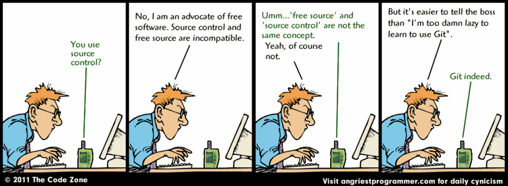

Normally when you use GIT for a long time, you end up with a huge list
of branches in both local and remote repository. In this post I
explain how you can get rid of that clutter.

## Deleting branches in the local repository

I assume you know how to list local branches in the repo (Simply use
`git branch`). There are couple commands you can use to delete a
local branch. Following command is the safe one to use when deleting
local branches. It prevents users accidentally deleting a branch which
is not fully merged in its upstream branch, or not in HEAD if no
upstream was set with --track or --set-upstream.

```bash
$ git branch -d <branch-name>
```

You will get the following error if you try to delete a branch which
is not fully merged.

```bash
$ git branch -d <branch-name>
error: The branch 'branch-name' is not fully merged.
If you are sure you want to delete it, run 'git branch -D branch-name'.
```

In that case you can use `-D` option to force branch deletion.

```bash
$ git branch -D <branch-name>
```

## Deleting branches in remote repository
There are couple git commands you can use to delete a git branch in a
remote repository. Please note that the following examples assume the
remote name as "origin". After Git [v1.7.0][1] you can use the
'--delete' option with git push to delete a remote branch.

```bash
$ git push origin --delete <branchName>
```

If you are using an older version you can use the command mentioned
below.

```bash
$ git push origin :<branchName>
```

Both the commands have the same effect. Therefore you can use the one
you like. For me the first command feels more natural.

## Creating a Git alias to delete both local and remote branches

You can create a [Git alias][2] if you find yourself executing these two
commands together most of the time.

```bash
$ git config --global alias.purge-branch '!git branch -d $1 && git push origin --delete $1 && echo Purging done for branch'
```

Now it is simple as issuing following command to delete a branch from both
local and remote repositories.

```bash
$ git purge-branch <branch-name>
Deleted branch <branch-name> (was 1cde3f).
To git@github.com:a5anka/<repo-name>.git
 - [deleted]         <branch-name>
Purging done for branch <branch-name>
```




[1]: https://github.com/gitster/git/blob/master/Documentation/RelNotes/1.7.0.txt
[2]: https://git-scm.com/book/en/v2/Git-Basics-Git-Aliases
